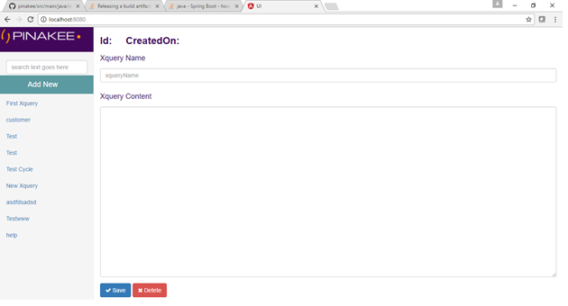
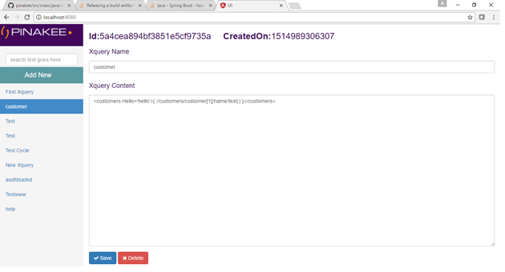
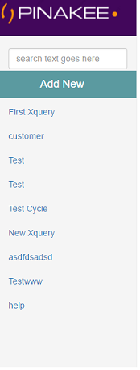
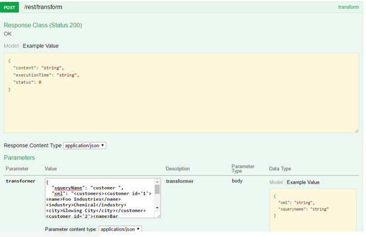

#Pinakee
Pinakee is a Microserivce based API for XML transformation from one format to another using Xquery . It uses saxon xquery engine for transformation. xquery engine is faster that the XSLT

API URL : <Domain:port>/rest/transform
METHOD: POST

**Request :**

```
{
	xml (string),
	xqueryName (string)

} 
```

Sample json
```
{
  "xqueryName": "customer ",
  "xml": "<customers><customer id='1'><name>Foo Industries</name><industry>Chemical</industry><city>Glowing City</city></customer><customer id='2'><name>Bar Refreshments</name><industry>Beverage</industry><city>Desert Town</city></customer><customer id='3'><name>Hello World Services</name><industry>Travel</industry><city>Coral Sands</city></customer></customers>"
}
```

## Overview 

Pinakee exposes a ReST api where the xml and the transformer name to be send the API responds with the transformed XML.
Pinakee has an UI where you can save the transformer xquery.

## Installation 


**Prerequisite** 
* Java 8 
* Mongo DB – latest version.

Download the ZIP file, unzip to get the JAR and application.properties , edit the application.properties and modify the DB connection details.

Start the application with the below command (after changing the mongo DB connection details)

```
java –jar -Dserver.port=8080  pinakee.jar   ( you can change the port if needed )
```
You can access the application in http://<domain:port>/

## For Users 

You can add, modify and edit the XQueries through UI.

Below is the simple screen capture for the CRUD

**New Xquery addition**



**Edit and Delete Screen**



**Search the Xquery name**



**List of Available xqueries** 


# API

API URL : http://localhost:8080/rest/transform

### Converting a sample XML
 
1. First add the xquery through UI
2. Give a name (Ref above add new screen)
3. Then using the rest API you can convert the xml from one format to another.

**Swagger UI** 



URL : http://localhost:8080/swagger-ui.html

API URL : http://localhost:8080/rest/transform

METHOD: POST
 
**__Sample xquery__**
```
<customers Hello='hello'>{ //customers/customer[1]/name/text() }</customers>
```

**__Sample Request__**
```
{
  "xqueryName": "customer",
  "xml": "<customers><customer id='1'><name>Foo Industries</name><industry>Chemical</industry><city>Glowing City</city></customer><customer id='2'><name>Bar Refreshments</name><industry>Beverage</industry><city>Desert Town</city></customer><customer id='3'><name>Hello World Services</name><industry>Travel</industry><city>Coral Sands</city></customer></customers>"
}
```
**__Sample Response__**
```
{
  "status": 0,
  "content": "<customers Hello=\"hello\">Foo Industries</customers>",
  "executionTime": "860ms"
}
```
## For Developers

### Technologies

* Spring boot
* Mongo DB
* Spring Data Mongo 
* Maven
* Java 8 

1. Pinakee is developed using Spring boot , where the the transformer logic is build using saxon processor.
2. Core transformation logic is available in org/pinakee/transform/
3. The API calls to add, Edit, delete the Xquery and Transform is available in org/pinakee/resource/
4. The application is configured to use Swagger UI where you can test the ReST APIs.
5. For handling custom exception  you can just specify the Error code and custom messages in the Application.properties
```
pinakee.exception-mapping.<fully qualified exception class>=<HTML error code>
pinakee.message-mapping. <fully qualified exception class>=<Customer error Message>
```
## Features to Add

Kryo Serialization in TCP connection to make the remote calls faster. 


